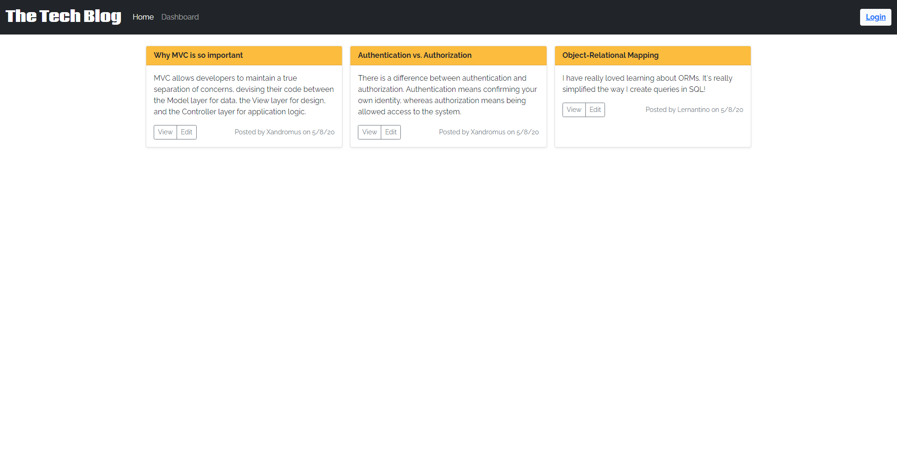

# Tech Blog

## Description
A technical blog where developers can publish their blog posts and comment on other developers’ posts. A user can login or sign up. When a user is logged in, they can add comments to existing blog posts on the homepage. On the dashboard page, users can create a new blog post as well as update or delete their posts. This app follows the MVC paradigm in its architectural structure, using Handlebars.js as the templating language, Sequelize as the ORM, and the express-session npm package for authentication.

## Usage
Clone the repo and in the [CLI](https://www.w3schools.com/whatis/whatis_cli.asp), navigate to the root folder. To start the server, type `npm start server`. To run the seed file, type `npm run seeds`.

## Technologies
* [Express](https://www.npmjs.com/package/express)
* [Express Handlebars](https://www.npmjs.com/package/express-handlebars)
* [MySQL2](https://www.npmjs.com/package/mysql2)
* [Sequelize](https://www.npmjs.com/package/sequelize)
* [Dotenv](https://www.npmjs.com/package/dotenv)
* [Bcrypt](https://www.npmjs.com/package/bcrypt)

## Screenshot

## URL
[Tech Blog](https://tech-blog-cm.herokuapp.com/)